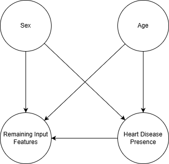

# Causal ML on UCI Heart Disease (Angiographic CAD)

This project was both an investigation and a build opportunity: an investigation into whether CAD prediction performance reflects stable causal signal versus confounded associations, and an opportunity to create a clinician-facing tool that is more causally robust in practice.

---

## Problem

Many machine learning models report around 80-82% accuracy on the UCI Heart Disease angiographic CAD prediction task. However:

- The dataset is observational, not randomized
- Key variables such as age and sex are strong confounders of CAD
- High predictive performance may reflect correlation, not causation
- Models may fail under distribution shift or intervention-like settings

As a result, it is unclear whether reported performance represents meaningful individual-level prediction or merely exploits confounded statistical structure.

---

## Solution

This project evaluates predictive performance before and after causal deconfounding using causal bootstrapping, allowing us to test whether ML models rely on:

- Genuine causal signal, or
- Confounding-driven associations

The approach explicitly encodes causal assumptions via a directed acyclic graph (DAG) and resamples data to approximate a deconfounded interventional distribution.

The intent is to prioritize the model that remains most reliable after this stress test (best calibration and stable discrimination), and use that model in a web app designed for clinician workflows.

---

## Causal Diagram

---

## Intended Model Selection Strategy

The repo was designed to evaluate the "most accurate and causally robust" model using this workflow:

1. Define causal assumptions with a DAG and generate deconfounded training datasets (for example backdoor and truncated-factorization variants).
2. Keep a confounded holdout split from the original observational data as a reality-check evaluation set.
3. Train multiple candidate classifiers on each deconfounded training dataset under the same feature schema.
4. Evaluate each candidate on the same holdout using discrimination and probability-quality metrics.
5. Rank candidates using an explicit rule: maximize `accuracy`, then `roc_auc`, then `pr_auc`, and break ties by minimizing `brier` and `log_loss`.
6. Retrain the selected winner on the full selected deconfounded dataset.
7. Train bootstrap replicas for uncertainty estimation and package everything into a single inference artifact for the API.

Interpretation of "causally robust" in this project:
- A model is treated as more causally robust if it remains strong when trained on deconfounded data and then evaluated on held-out observational data, with stable calibration and discrimination.
- This is an intended robustness proxy under stated DAG assumptions, not proof of true causal identification.

Current repository snapshot:
- The FastAPI service is configured to use a single neural-network artifact path via `MODEL_ARTIFACT_PATH` (no fallback model path).

---

## Method Overview

- Causal DAG Specification
  - Age, Sex -> CAD (confounding)
  - Clinical features (cholesterol, blood pressure, etc.) -> CAD
  - Optional pathways: Age/Sex -> clinical features

- Causal Bootstrapping
  - Based on Nunes et al. (2019)
  - Resamples observational data to remove confounding effects implied by the DAG

- Model Training
  - Train identical classifiers on:
    - Original (associational) dataset
    - Deconfounded (causal bootstrap) dataset

- Performance Comparison
  - Compare expected predictive quality and calibration
  - Quantify uncertainty via repeated bootstrapping and cross-validation

---

## Functionalities

- Explicit causal modeling via DAG assumptions
- Causal bootstrapping to remove confounding structure
- Side-by-side evaluation of associational vs causal performance
- Multiple classifiers for robustness analysis
- Bootstrap-based confidence intervals for performance differences
- Calibration analysis to assess probabilistic reliability

---

## Technologies Used

- Python
- scikit-learn - classical ML models and evaluation
- NumPy / Pandas - data processing
- Causal bootstrapping - implementation following Nunes et al. (2019)

Optional:
- XGBoost / LightGBM
- PyTorch or Keras (simple neural networks)

---

## Evaluation Metrics

To ensure clinically and causally meaningful evaluation, the analysis prioritizes proper scoring rules and calibration metrics over threshold-dependent accuracy.

### Primary metrics
- Brier Score (expected squared error of predicted probabilities)
- Calibration slope and intercept

### Secondary metrics
- ROC AUC
- Precision-Recall AUC
- Log loss (cross-entropy)

### Optional decision-oriented analysis
- Decision curve analysis (net benefit across risk thresholds)

### Uncertainty estimation
- Repeated causal bootstrapping
- Cross-validation
- Bootstrap confidence intervals on metric differences between original and deconfounded datasets

Key quantities of interest:
- Delta Brier = Brier(deconfounded) - Brier(original)
- Delta Calibration slope
- Delta ROC AUC

---

## Impact

This project provides a causal stress test for medical machine learning models by:

- Distinguishing predictive accuracy from causal validity
- Revealing when performance collapses after deconfounding
- Demonstrating risks of deploying associational models in clinical settings
- Encouraging causal thinking in healthcare ML evaluation

It also translates those findings into deployment choices: prefer causally robust model behavior over headline associational accuracy when exposing predictions to clinicians.

In other words, the work is not only analytical; it is also translational, using the investigation to shape a practical clinical application.

---

## Expected Outcome

- Significant degradation after deconfounding
  - Indicates reliance on confounded associations
- Minimal change after deconfounding
  - Suggests predictive signal persists beyond major confounders
- Unstable or counterintuitive changes
  - Highlight sensitivity to causal assumptions and limited sample size

> This analysis does not prove causality, but evaluates whether predictive success is robust to causal deconfounding under explicit assumptions.

---

## References

- UCI Heart Disease Dataset
  https://archive.ics.uci.edu/dataset/45/heart+disease

- Nunes et al., Causal Bootstrapping
  https://arxiv.org/abs/1910.09648

- Example angiographic CAD clinical study
  https://www.sciencedirect.com/science/article/pii/0002914989905249

---

## Web App Backend Split (2026)

The web application now uses two backend services:

- FastAPI (`fastapi-backend/`): ML inference only
- Spring Boot (`spring-backend/`): auth + Supabase CRUD only

Live web application:
- https://cad-causal-risk-predictor.web.app/

Clinical intent in the web app:
- Surface predictions from the most causally robust candidate model, rather than the highest raw associational score.
- Let clinical domain knowledge be represented explicitly (for example via configurable risk settings/thresholds and labels).
- Improve reliability of patient-level risk estimates by combining data-driven learning with domain-informed rules.

See:

- [`WEBAPP_SETUP.md`](WEBAPP_SETUP.md)
- [`docs/ARCHITECTURE.md`](docs/ARCHITECTURE.md)
- [`docs/ML_API.md`](docs/ML_API.md)
- [`docs/CRUD_API.md`](docs/CRUD_API.md)
- [`docs/DEPLOY_RENDER_FIREBASE.md`](docs/DEPLOY_RENDER_FIREBASE.md)
