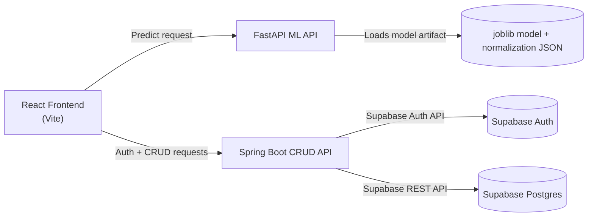
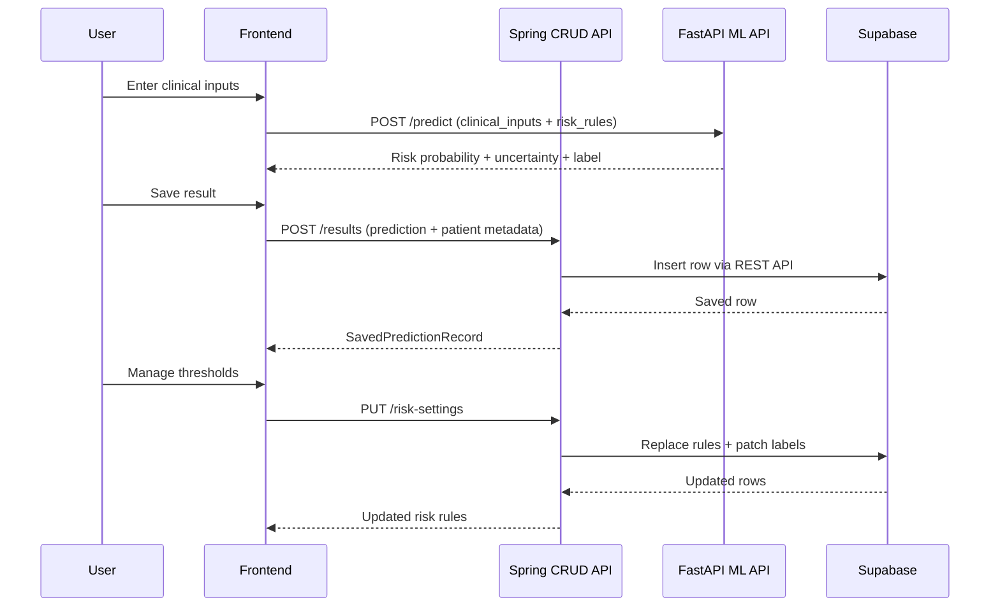

# System Architecture

## Overview

The application is now split into **two backend services**:

- **FastAPI (`fastapi-backend/`)**: ML model inference only (`/health`, `/model-info`, `/predict`)
- **Spring Boot (`spring-backend/`)**: Supabase auth + CRUD over Postgres tables (`/auth/*`, `/risk-settings`, `/results`)

This separation allows the ML API to run standalone and be reused by other clients without coupling to app-specific persistence.

## Component Diagram



## Tier Architecture And Communication

```mermaid
flowchart TB
    subgraph T1[Presentation Tier]
        UI[React Frontend (Vite)]
    end

    subgraph T2[Service Tier]
        CRUD[Spring Boot CRUD API]
        ML[FastAPI ML API]
    end

    subgraph T3[Data Tier]
        DB[(Supabase Postgres)]
    end

    UI -->|Auth + CRUD requests| CRUD
    CRUD -->|JSON responses| UI

    UI -->|Prediction requests| ML
    ML -->|Prediction responses| UI

    CRUD -->|Read/Write via Supabase REST| DB
    DB -->|Row data + status| CRUD
```

## Runtime Request Flow



## API Ownership

- **FastAPI ML API**
  - `GET /health`
  - `GET /model-info`
  - `POST /predict`
  - `POST /predict/batch-csv`

- **Spring Boot CRUD API**
  - `POST /auth/signup`
  - `POST /auth/login`
  - `GET /auth/me`
  - `POST /auth/logout`
  - `GET /risk-settings`
  - `PUT /risk-settings`
  - `GET /results`
  - `POST /results`
  - `PATCH /results/{resultId}`

## Environment Variables

### FastAPI (ML API)

- `CORS_ORIGINS`
- `MODEL_ARTIFACT_PATH` (optional override)
- `NORMALIZATION_SETTINGS_PATH` (optional override)

### Spring Boot (CRUD API)

- `SUPABASE_URL`
- `SUPABASE_ANON_KEY`
- `SUPABASE_RESULTS_TABLE` (optional)
- `SUPABASE_RISK_SETTINGS_TABLE` (optional)
- `AUTH_COOKIE_NAME` (optional)
- `AUTH_COOKIE_SECURE` (optional)
- `AUTH_COOKIE_SAMESITE` (optional)
- `CORS_ORIGINS`
- `CRUD_API_PORT` (optional, default `8080`)

## Frontend Routing

By default, the frontend uses:

- `VITE_ML_API_BASE_URL=/ml-api`
- `VITE_CRUD_API_BASE_URL=/crud-api`

`vite.config.js` proxies:

- `/ml-api` -> `http://localhost:8000` (FastAPI)
- `/crud-api` -> `http://localhost:8080` (Spring Boot)
