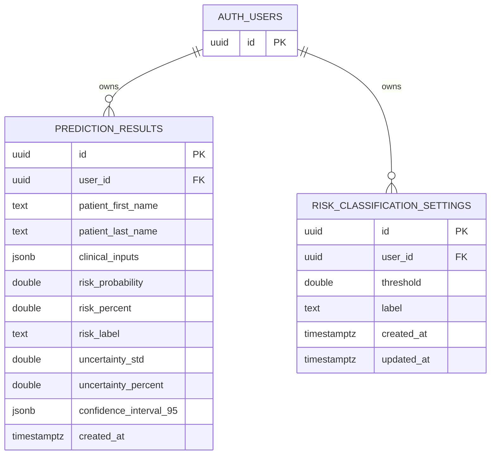

# Spring Boot CRUD Backend (Supabase)

This service handles app auth/session and CRUD operations against Supabase Postgres.

## Run

```powershell
cd spring-backend
# one-time setup
Copy-Item .env.example .env
# then edit .env with your real Supabase values
.\mvnw.cmd spring-boot:run
```

Default port: `8080`

Spring Boot auto-loads:

- `spring-backend/.env`

Docker Compose also injects Spring environment variables from `spring-backend/.env`.

## Required configuration values

- `SUPABASE_URL`
- `SUPABASE_ANON_KEY`

Optional:

- `SUPABASE_RESULTS_TABLE` (default `prediction_results`)
- `SUPABASE_RISK_SETTINGS_TABLE` (default `risk_classification_settings`)
- `AUTH_COOKIE_NAME` (default `cb_auth_token`)
- `AUTH_COOKIE_SECURE` (default `false`)
- `AUTH_COOKIE_SAMESITE` (default `Lax`)
- `SIGNUP_PASSWORD_MIN_LENGTH` (default `12`)
- `AUTH_RATE_LIMIT_WINDOW_SECONDS` (default `900`)
- `AUTH_LOGIN_MAX_ATTEMPTS` (default `8`)
- `AUTH_SIGNUP_MAX_ATTEMPTS` (default `5`)
- `CORS_ORIGINS`
- `CRUD_API_PORT`

## Database Schema Diagram

This diagram summarizes the Postgres tables used by the CRUD service. `auth.users` is Supabase-managed; the app-owned tables both reference it through `user_id`.



Constraint notes:

- `prediction_results.user_id -> auth.users.id`
- `risk_classification_settings.user_id -> auth.users.id`
- `risk_classification_settings` enforces `unique (user_id, threshold)`
- `threshold` is constrained to `[0, 1]`

## Supabase tables (SQL)

```sql
create extension if not exists pgcrypto;

create table if not exists public.prediction_results (
  id uuid primary key default gen_random_uuid(),
  user_id uuid not null default auth.uid() references auth.users(id) on delete cascade,
  patient_first_name text not null,
  patient_last_name text not null,
  clinical_inputs jsonb not null,
  risk_probability double precision not null,
  risk_percent double precision not null,
  risk_label text not null,
  uncertainty_std double precision not null,
  uncertainty_percent double precision not null,
  confidence_interval_95 jsonb not null,
  created_at timestamptz not null default now()
);

create table if not exists public.risk_classification_settings (
  id uuid primary key default gen_random_uuid(),
  user_id uuid not null default auth.uid() references auth.users(id) on delete cascade,
  threshold double precision not null check (threshold >= 0 and threshold <= 1),
  label text not null,
  created_at timestamptz not null default now(),
  updated_at timestamptz not null default now(),
  unique (user_id, threshold)
);

alter table public.prediction_results enable row level security;
alter table public.risk_classification_settings enable row level security;

drop policy if exists "users can read own results" on public.prediction_results;
create policy "users can read own results"
on public.prediction_results
for select
using (auth.uid() = user_id);

drop policy if exists "users can insert own results" on public.prediction_results;
create policy "users can insert own results"
on public.prediction_results
for insert
with check (auth.uid() = user_id);

drop policy if exists "users can update own results" on public.prediction_results;
create policy "users can update own results"
on public.prediction_results
for update
using (auth.uid() = user_id)
with check (auth.uid() = user_id);

drop policy if exists "users can read own risk settings" on public.risk_classification_settings;
create policy "users can read own risk settings"
on public.risk_classification_settings
for select
using (auth.uid() = user_id);

drop policy if exists "users can insert own risk settings" on public.risk_classification_settings;
create policy "users can insert own risk settings"
on public.risk_classification_settings
for insert
with check (auth.uid() = user_id);

drop policy if exists "users can update own risk settings" on public.risk_classification_settings;
create policy "users can update own risk settings"
on public.risk_classification_settings
for update
using (auth.uid() = user_id)
with check (auth.uid() = user_id);

drop policy if exists "users can delete own risk settings" on public.risk_classification_settings;
create policy "users can delete own risk settings"
on public.risk_classification_settings
for delete
using (auth.uid() = user_id);
```

## API endpoints

- `GET /health`
- `POST /auth/signup`
- `POST /auth/login`
- `GET /auth/me`
- `POST /auth/logout`
- `POST /auth/password-reset/request`
- `POST /auth/password-reset/confirm`
- `GET /risk-settings`
- `PUT /risk-settings`
- `GET /results`
- `POST /results`
- `PATCH /results/{resultId}`

## Notes

- This service does not run inference.
- Call the FastAPI ML service first, then persist inference output using `POST /results`.
- Signup enforces a stronger password policy than login: minimum 12 characters, at least one letter, and no email-name reuse.
- Login and signup endpoints now apply in-memory rate limiting per IP and per email address.
- If `CORS_ORIGINS` includes any non-local origin, `AUTH_COOKIE_SECURE=true` is now required at startup.
